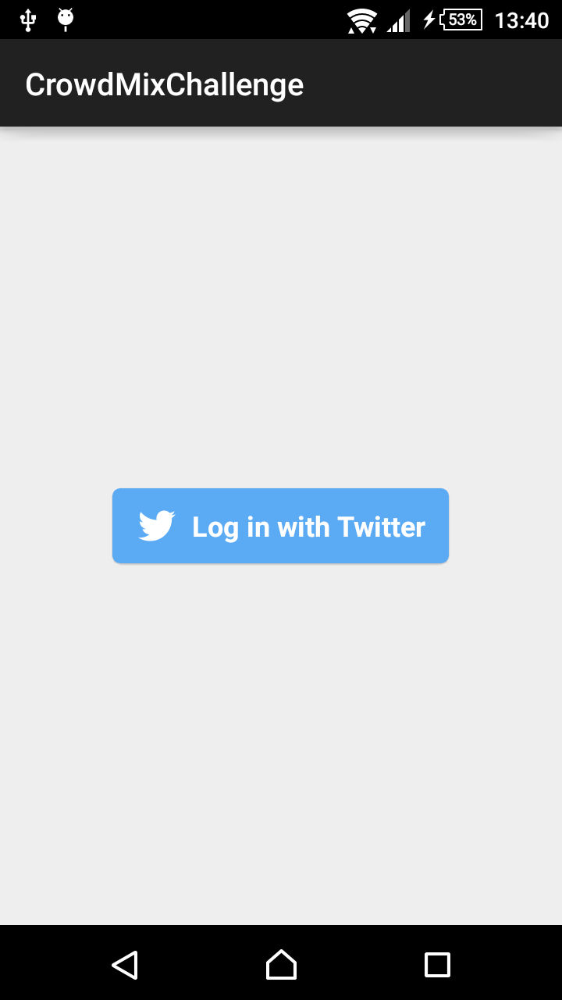
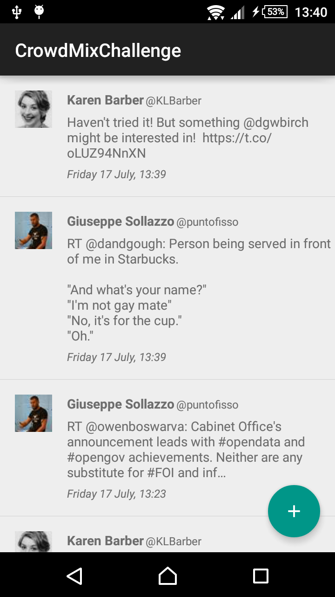
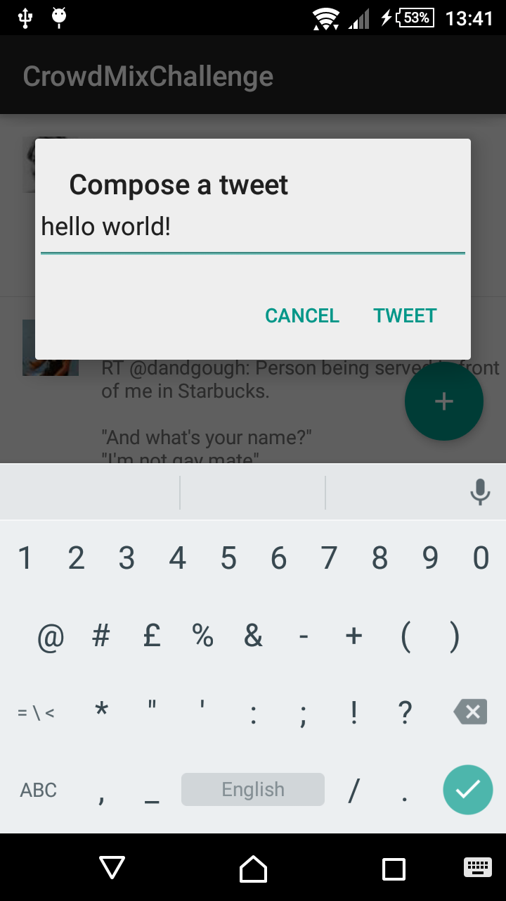

# CrowdMix Challenge

##Description

This small project lets you log in with Twitter, retrieve your home timeline and post a new text tweet.


##APK

You can find the apk [here](https://github.com/dbottillo/CrowdmixChallenge/app-debug-unaligned.apk)

##Screenshots:





##How to Build

All you have to do is open the project with Android Studio and run the module called 'app'.

##Libraries

This project uses these library:

```xml
com.android.support:appcompat-v7:22.2.0
com.github.dbottillo:segmented-loader:0.9.0
com.android.support:design:22.2.0
com.squareup.picasso:picasso:2.5.2
com.twitter.sdk.android:twitter:1.6.0@aar'
```


##License

```
Copyright 2015 Daniele Bottillo

Licensed under the Apache License, Version 2.0 (the "License");
you may not use this file except in compliance with the License.
You may obtain a copy of the License at

    http://www.apache.org/licenses/LICENSE-2.0

Unless required by applicable law or agreed to in writing, software
distributed under the License is distributed on an "AS IS" BASIS,
WITHOUT WARRANTIES OR CONDITIONS OF ANY KIND, either express or implied.
See the License for the specific language governing permissions and
limitations under the License.
```